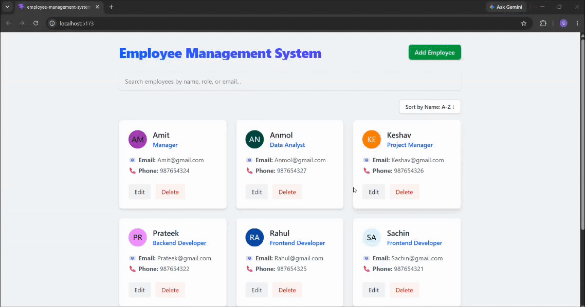

# Employee Management System

A modern, fast, and responsive single-page React application for managing employee data.


## 📸 App Preview


## ✨ Features

- **Full CRUD Operations**: Create, read, update, and delete employee records intuitively.
- **Real-time Search & Filter**: Instantly search through employees by Name, Role, or Email.
- **Sorting Mechanisms**: Easily sort the employee directory alphabetically.
- **Data Persistence**: Uses browser `localStorage` to ensure data survives across page reloads.
- **Responsive UI/UX**: Built with Tailwind CSS, featuring floating modals, dynamic avatars, and friendly empty states.
- **Form Validation**: Built-in logic to ensure required fields are correctly filled before submission.

## 🚀 Quick Start

### Prerequisites
Make sure you have [Node.js](https://nodejs.org/) installed on your machine.

### Installation

1. **Clone the repository**
   ```bash
   git clone <your-repo-link>
   cd Employee-Management-System
   ```

2. **Install dependencies**
   ```bash
   npm install
   ```

3. **Start the development server**
   ```bash
   npm start
   ```

4. **Open the app**
   Navigate to `http://localhost:5173` in your favorite web browser.

## 🛠️ Built With
* **React 19** - UI Framework
* **Vite** - Frontend Tooling
* **Tailwind CSS 4** - Styling
* **UI Avatars** - Dynamic profile image generation
